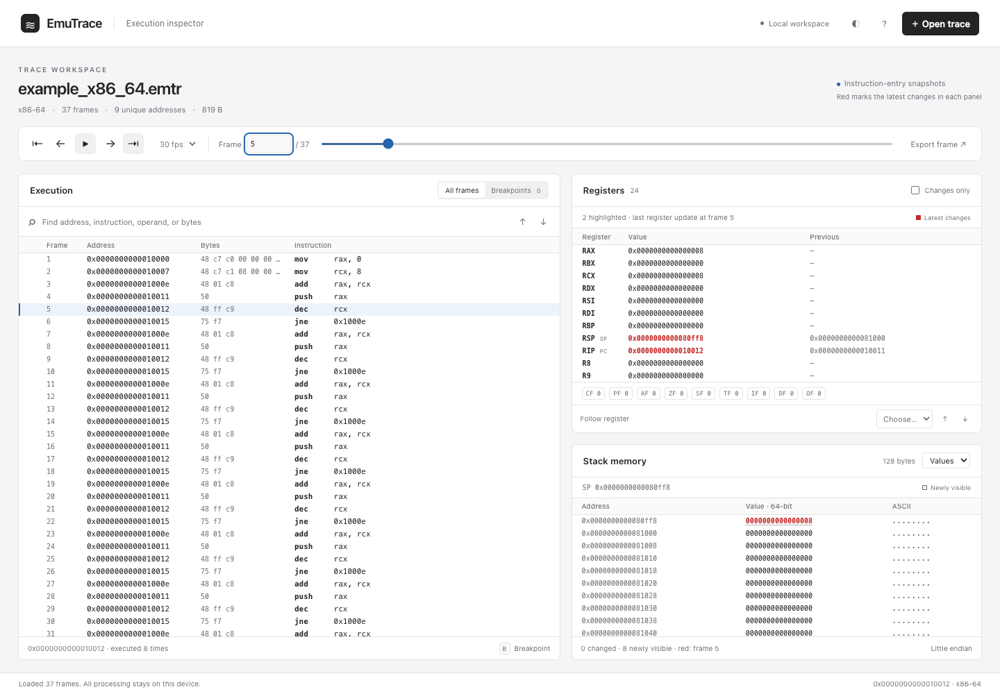

# EmuTrace

Inspect Unicorn execution locally, one instruction at a time. Record CPU registers and stack memory, then open a trace in the standalone browser viewer. No server, account, CDN, or upload is required.



## Start here

Python 3.9+ is required for recording. Use a current Safari, Chrome, Edge, or Firefox for the viewer.

```bash
python3 -m venv .venv
source .venv/bin/activate
pip install -r requirements.txt
python example_trace.py
```

Open **emu_viewer.html** and drop `trace_x86_64.emtr` onto it. **Explore an example** opens a real, bundled trace immediately, including when the viewer is opened through `file://`.

## Record a trace

```python
import unicorn
from unicorn.x86_const import UC_X86_REG_RSP
from emu_tracer import Tracer, ARCH

mu = unicorn.Uc(unicorn.UC_ARCH_X86, unicorn.UC_MODE_64)
mu.mem_map(0x400000, 0x1000)
mu.mem_map(0x700000, 0x1000)
code = (
    b"\x48\xc7\xc0\x00\x00\x00\x00"  # mov rax, 0
    b"\x48\xff\xc0"  # inc rax
    b"\x90"  # nop
)
mu.mem_write(0x400000, code)
mu.reg_write(UC_X86_REG_RSP, 0x700800)

with Tracer(mu, ARCH.X86_64, stack_capture=128) as tracer:
    mu.emu_start(0x400000, 0x400000 + len(code))
tracer.save("my_trace.emtr")
```

`arch` is optional; the tracer detects the engine configuration. ARM/Thumb switches are detected on each instruction. Explicit incompatible architecture choices fail before installing a hook.

- `attach()` and `detach()` are idempotent. The context manager detaches even if emulation raises.
- `dump()` and `save()` take a snapshot **without detaching**; recording can continue afterward.
- `clear()` discards recorded frames and resets the capture-limit indicator.
- `stack_capture=0` disables stack capture. Unmapped stack memory produces an empty snapshot; a partially mapped range retains its readable prefix.
- `max_frames=100_000` sets a recording limit. The default is 1,000,000 frames, with a 256 MiB uncompressed payload ceiling. Reaching either limit stops recording, **not emulation**. `tracer.truncated` and v2 files report when frames were omitted.
- `disassemble=False` records bytes without loading Python Capstone. Modern architecture decoding in the viewer requires the disassembly embedded by the default setting.

## Snapshot semantics

A frame describes state **before** its instruction executes. Change events compare frame N with frame N−1, regardless of playback direction or the last row you clicked. Red highlights retain the latest event in each panel; the register Previous column shows the value before that event. They describe observations since the preceding hook, not guaranteed effects of one completed instruction: other emulator hooks can change state, and an instruction can subsequently fault. The final instruction’s resulting state is not included.

The stack defaults to native-width hexadecimal values decoded using the target endianness, like a debugger stack view: x86-64 bytes `08 00 00 00 00 00 00 00` display as `0000000000000008`. The **Bytes** selector shows the original bytes in ascending address order; ASCII always follows address order. Partial values show `??` for uncaptured bytes.

Stack comparisons use absolute memory addresses, including when SP moves. Red text marks the latest changes in each panel and remains red until another change in that panel replaces it. Normal instruction-pointer advances do not clear data-register highlights. Stack values turn red for changed or newly visible bytes; newly visible bytes retain dotted underlining because their prior value is unknown. In Values mode, the whole affected word is red; in Bytes mode, only the affected bytes are red. Highlight history follows the trace, including backward stepping and direct jumps. For x86 real mode, the snapshot address includes `SS × 16`; for the SPARC V9 64-bit ABI, an odd SP includes the 2047-byte stack bias. The raw SP register remains visible separately.

The capture covers scalar integer and status registers up to 64 bits, not SIMD/FPU registers, arbitrary memory writes, or a complete process checkpoint. This is a history inspector, not reverse execution of the emulator.

## Architecture support

The registry covers all ten architecture families shared by [Unicorn](https://github.com/unicorn-engine/unicorn) and [Capstone 5](https://github.com/capstone-engine/capstone/tree/5.0.6), in 23 configurations. Numeric IDs 0–8 retain their original meanings.

| Family | `ARCH` selectors |
|---|---|
| x86 | `X86_16`, `X86`, `X86_64` |
| ARM | `ARM16` (Thumb), `ARM32`, `ARM16BE`, `ARM32BE`, `ARM_MCLASS` (Cortex-M) |
| AArch64 | `ARM64`, `ARM64BE` |
| MIPS | `MIPS`, `MIPSEL`, `MIPS64`, `MIPS64EL` |
| PowerPC | `PPC`, `PPC64` (big endian) |
| SPARC | `SPARC`, `SPARC64` (big endian) |
| Motorola 68K | `M68K` (68000, big endian) |
| RISC-V | `RISCV32`, `RISCV64` (including compressed instructions) |
| IBM SystemZ | `S390X` |
| Infineon TriCore | `TRICORE` (1.6.2 decoder) |

These are baseline ISA modes. CPU-specific extensions such as microMIPS, ARM BE8, or other M68K/TriCore decoder generations are not selectable. AArch64 big-endian data still uses little-endian instruction encoding. The user's Unicorn engine controls emulation and CPU selection; the tracer never changes its CPU model.

Generate a specific example or all examples:

```bash
python example_trace.py riscv64
python example_trace.py s390x
python example_trace.py --all --output-dir traces
```

The examples account for SPARC64’s 8 KiB and TriCore’s 16 KiB mapping alignment, real-mode x86 segments, and PowerPC64’s explicit model initialization. On the tested Unicorn 2.1.4 macOS ARM64 build, SPARC64 repeats its second instruction with a code hook even without EmuTrace. Its smoke example is bounded to two instructions. EmuTrace records the actual engine behavior; it does not repair Unicorn’s execution semantics.

## Viewer features

- Flat light and dark appearances, compact 18-pixel data rows without separator lines, system fonts, keyboard focus indicators, and a responsive layout.
- Virtualized instruction rows and stack bytes for large traces; frame number input, timeline scrubbing, and adjustable playback speed.
- Address, mnemonic, operand, and opcode search with next/previous matches.
- Frame breakpoints, a breakpoints-only view, and playback that pauses at breakpoints. Breakpoints belong to instruction occurrences and reset when a new file opens.
- Register previous values, a filter for highlighted changes, architecture-specific flag display, and next/previous change navigation for a selected register.
- Stack byte comparisons, ASCII, byte order, address execution counts, and selected-frame JSON export.
- Full 64-bit integer precision, including addresses, register comparisons, and exported hex strings.
- Bounded decompression, strict field validation, empty-file handling, and retention of the current trace if opening a replacement fails.

| Shortcut | Action |
|---|---|
| `→` / `n`, `←` / `p` | Next / previous frame |
| `Space` | Play / pause |
| `Home`, `End` | First / last frame |
| `b` / `F2`, double-click a row | Toggle breakpoint |
| `/` | Focus search |
| `Enter`, `Shift+Enter` in search | Next / previous match |

Shortcuts do not interfere with text fields, buttons, selects, or the help dialog. The UI uses **one-based** frame numbers; Python frame lists remain zero-based.

## File format and compatibility

All wire integers are little endian, regardless of the emulated architecture. Both versions begin with a 16-byte uncompressed header:

| Field | Type |
|---|---|
| Magic `EMTR` | 4 bytes |
| Version (1 or 2) | uint32 |
| Architecture ID | uint32 |
| Frame count | uint32 |

The remainder is one zlib stream. V2 starts with a uint32 flags word (bit 0: capture limit reached; other bits reserved). V1 has no flags word. Each frame contains:

```text
address            uint64
opcode_length      uint16
opcode             bytes[opcode_length]
register_count     uint16
  name_length      uint8
  register_name    ASCII[name_length]
  register_value   uint64
stack_address      uint64
stack_length       uint32
stack_bytes        bytes[stack_length]

# V2 only, after each frame:
instruction_arch   uint32
mnemonic_length    uint16
operands_length    uint16
mnemonic           UTF-8[mnemonic_length]
operands           UTF-8[operands_length]
```

V2 embeds Python Capstone disassembly and the per-instruction architecture. The viewer reads existing v1 files using the bundled legacy `capstone.min.js`. That older decoder does not contain the newer architectures and its address binding is limited to 32 bits; unsupported instructions or higher addresses are explicitly shown as raw bytes. Newly recorded v2 traces avoid these limitations. A failed decode never invents an instruction.

`tracer.save(path, version=1)` exports the original structure for older viewers, omitting v2 disassembly, mode metadata, and the truncation flag. Old viewers only recognize the original architecture IDs. Neither version is a substitute for emulator state serialization.

```python
from emu_tracer import TraceReader

reader = TraceReader().load("my_trace.emtr")
print(reader.arch_name, reader.n_frames, reader.truncated)
print(reader.frames[0]["regs"])
```

`python emu_tracer.py dump my_trace.emtr` exports JSON. Addresses and register values use hexadecimal strings to remain exact in JavaScript consumers.

## Development and validation

The viewer has no build step or runtime npm dependencies. Node 20+ and pnpm are only needed for tests and formatting. Run `ruff check .` and `ruff format --check .` for Python, or `pnpm run format:check` for browser code.

```bash
pip install -r requirements-dev.txt
python -m pytest -q
pnpm install --frozen-lockfile
pnpm test
pnpm exec playwright install chromium
pnpm run test:ui
```

To use an installed Chrome binary instead, set `EMUTRACE_BROWSER` to its executable path. The browser suite writes ignored screenshots under `test-results/` and tests direct `file://` loading, zero external requests, legacy decoding, navigation, state comparison, breakpoints, playback, exports, concurrent loads, empty/corrupt files, a 30,000-frame trace, and mobile layout.

`architectures.py` is the source of truth for both languages. After changing its metadata, run `python scripts/build_architectures.py`. Rebuild the offline demo with `python scripts/build_demo.py`. The Python tests run actual emulation for all 23 configurations, with separate processes to isolate native engine state.
